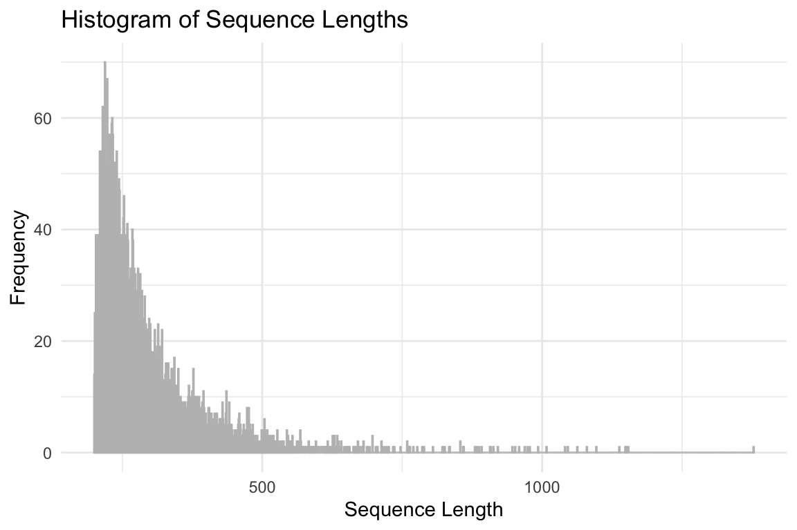
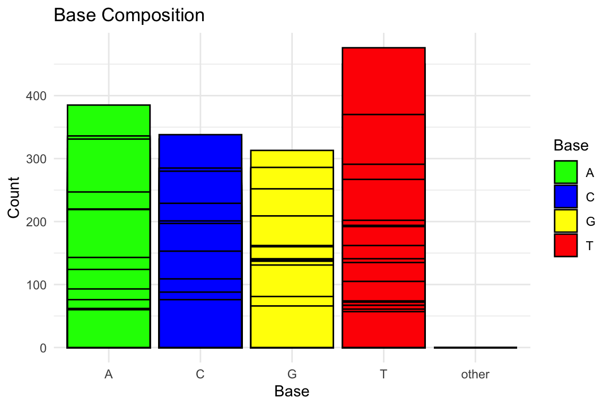
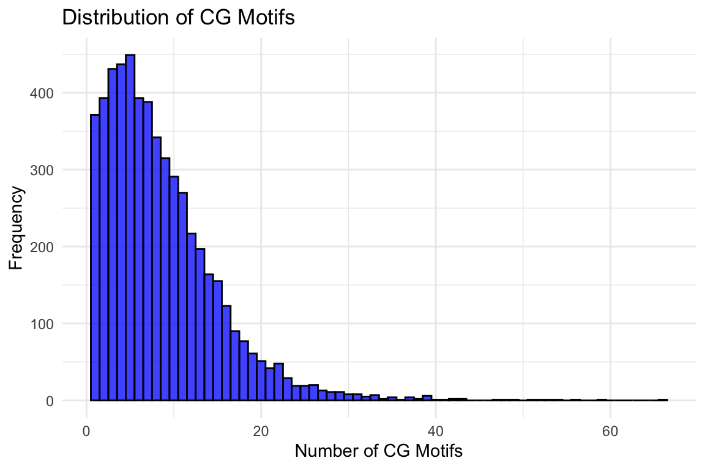

::: callout-note
## How to read this module
This is a **walkthrough, not a script**. The code is shown so you can read it, understand what each step does, and adapt it — the page itself does not execute anything. Expected outputs are shown as static blocks beneath the commands that produce them.

To actually run it, you need NCBI BLAST+ and a machine with some memory and patience. See [Computing Resources](05-computers.qmd).
:::

## What you are doing and why

You have a few thousand sequences and no idea what they are. Maybe they came off a de novo assembly of a non-model organism, so there is no annotation to inherit. You want to know which genes are present.

The strategy is comparison. Take each unknown sequence, search it against a database of proteins whose function *is* known, and transfer the annotation from the best match. That is the whole idea behind BLAST — Basic Local Alignment Search Tool.

The database used here is **UniProt/Swiss-Prot**: the manually reviewed portion of UniProt. It is much smaller than the full database and much better curated, which is exactly the trade you want for annotation. A confident match to a reviewed protein is worth more than a match to something machine-annotated.

By the end you will have gone from an anonymous FASTA file to a table of gene names, organisms, and Gene Ontology terms.

## Which BLAST program to use

This trips people up, so settle it first. The program name tells you what is being compared:

| Program | Query | Database | Use when |
|---|---|---|---|
| `blastn` | nucleotide | nucleotide | Comparing DNA to DNA |
| `blastp` | protein | protein | You already have protein sequences |
| `blastx` | **nucleotide, translated** | protein | You have transcripts/DNA and want to know what protein they encode |
| `tblastn` | protein | nucleotide, translated | Looking for a known protein in an unannotated genome |

This module uses **`blastx`** for the unknown transcripts (nucleotide query against a protein database) and **`blastp`** for the oyster case study (where NCBI already provides translated proteins).

## A note on paths

Commands below call `blastx`, `blastp`, and `makeblastdb` directly, assuming BLAST+ is on your `PATH`.

On lab machines it may be installed somewhere specific instead. Rather than hardcoding a version into every command — which is how a tutorial silently rots — set it once:

``` bash
# Adjust to wherever BLAST+ lives on your machine, then use $BLAST/ below.
export BLAST=/home/shared/ncbi-blast-2.11.0+/bin

$BLAST/blastx -version
```

Check the version you actually have rather than assuming. Paths and version numbers in older lab notebooks are frequently stale.

------------------------------------------------------------------------

# Part 1 — Build the database

## Download Swiss-Prot

UniProt publishes releases, and **which release you used is part of your methods**. Recording it is not bookkeeping for its own sake — annotation results shift between releases, and a reviewer or a future you will want to know.

Set the release once and let the filenames follow from it:

``` bash
cd ../data

# Record the release you are actually downloading.
# Check https://www.uniprot.org/help/release-statistics for the current one.
RELEASE=r2025_03

curl -O https://ftp.uniprot.org/pub/databases/uniprot/current_release/knowledgebase/complete/uniprot_sprot.fasta.gz

mv uniprot_sprot.fasta.gz uniprot_sprot_${RELEASE}.fasta.gz
gunzip -k uniprot_sprot_${RELEASE}.fasta.gz
```

::: callout-warning
## Keep the release consistent
Using a variable here is deliberate. If you type the release by hand in the download step and again in the database step, sooner or later they will disagree — you will build a database from one file while believing you built it from another, and nothing will error. Set it once, reuse it.
:::

## Make the BLAST database

A FASTA file is not searchable as-is. `makeblastdb` builds the index BLAST needs:

``` bash
mkdir -p ../blastdb

makeblastdb \
-in ../data/uniprot_sprot_${RELEASE}.fasta \
-dbtype prot \
-out ../blastdb/uniprot_sprot_${RELEASE}
```

`-dbtype prot` says these are protein sequences. `-out` gives a *prefix*, not a filename — several index files are written using it, and you pass that same prefix to `-db` later.

------------------------------------------------------------------------

# Part 2 — Annotate unknown sequences

## Get the query sequences

The example file is a de novo transcriptome assembly:

``` bash
curl -k https://eagle.fish.washington.edu/cnidarian/Ab_4denovo_CLC6_a.fa \
> ../data/Ab_4denovo_CLC6_a.fa
```

## Look at your input first

Always. Knowing the size and shape of your input tells you whether the run will take minutes or days, and catches a truncated download before it costs you an afternoon.

``` bash
head -3 ../data/Ab_4denovo_CLC6_a.fa

echo "How many sequences?"
grep -c ">" ../data/Ab_4denovo_CLC6_a.fa
```

Basic properties worth plotting for any new assembly — sequence length distribution, base composition, and CG motif counts:

::: {layout-ncol="3"}
{fig-alt="Histogram of sequence lengths in the assembly"}

{fig-alt="Bar chart of A, C, G, T base counts"}

{fig-alt="Histogram of CG motif counts per sequence"}
:::

Those were produced in R with `Biostrings` and `ggplot2`:

``` r
library(Biostrings)
library(tidyverse)

sequences <- readDNAStringSet("../data/Ab_4denovo_CLC6_a.fa")

# Sequence length distribution
tibble(Length = width(sequences)) |>
  ggplot(aes(x = Length)) +
  geom_histogram(binwidth = 1, color = "grey", fill = "blue", alpha = 0.75) +
  labs(title = "Histogram of Sequence Lengths", x = "Sequence Length", y = "Frequency") +
  theme_minimal()

# Base composition
alphabetFrequency(sequences, baseOnly = TRUE) |>
  as_tibble() |>
  pivot_longer(everything(), names_to = "Base", values_to = "Count") |>
  ggplot(aes(x = Base, y = Count, fill = Base)) +
  geom_col(color = "black") +
  labs(title = "Base Composition", x = "Base", y = "Count") +
  theme_minimal()
```

## Run blastx

``` bash
blastx \
-query ../data/Ab_4denovo_CLC6_a.fa \
-db ../blastdb/uniprot_sprot_${RELEASE} \
-out ../output/Ab_4-uniprot_blastx.tab \
-evalue 1E-20 \
-num_threads 20 \
-max_target_seqs 1 \
-outfmt 6
```

The arguments that matter:

- **`-evalue 1E-20`** — the significance cutoff. E-value is the number of hits this good you would expect *by chance* in a database this size, so smaller is stricter. `1E-20` is conservative, appropriate when you would rather miss a real gene than record a wrong one.
- **`-num_threads 20`** — how many CPUs to use. Set this to what your machine actually has; check with `nproc`.
- **`-max_target_seqs 1`** — keep only the best hit per query. Fine for "what is this gene," wrong if you want to examine the hit distribution.
- **`-outfmt 6`** — tabular output. This is the format everything downstream expects.

::: callout-tip
## Start small
Before committing to a run over thousands of sequences, take the first few and time it:

``` bash
head -100 ../data/Ab_4denovo_CLC6_a.fa > ../data/test.fa
```

Run the pipeline on that. You will find your path typos in 30 seconds rather than 3 hours.
:::

## Check the output

``` bash
head -2 ../output/Ab_4-uniprot_blastx.tab

echo "Number of hits"
wc -l ../output/Ab_4-uniprot_blastx.tab
```

The 12 columns of `-outfmt 6`, in order:

| # | Column | Meaning |
|---|---|---|
| 1 | `qseqid` | Query sequence ID |
| 2 | `sseqid` | Subject (database hit) ID |
| 3 | `pident` | Percent identical |
| 4 | `length` | Alignment length |
| 5 | `mismatch` | Mismatches |
| 6 | `gapopen` | Gap openings |
| 7–8 | `qstart`, `qend` | Alignment range on the query |
| 9–10 | `sstart`, `send` | Alignment range on the subject |
| 11 | `evalue` | E-value |
| 12 | `bitscore` | Bit score |

There is no header row in the file — you have to know this table.

Note that the hit count is normally **lower** than your sequence count. Sequences with no match above the E-value threshold simply produce no line. That is a result, not a failure: plenty of transcripts in a non-model assembly have no reviewed homolog.

## Split the UniProt identifier

Swiss-Prot IDs arrive as `sp|P12345|NAME_SPECIES`. The middle field is the accession you need for joining:

``` bash
tr '|' '\t' < ../output/Ab_4-uniprot_blastx.tab \
> ../output/Ab_4-uniprot_blastx_sep.tab

head -1 ../output/Ab_4-uniprot_blastx_sep.tab
```

This turns column 2 into three columns, so everything after it shifts right by two. The accession lands in **column 3**, and the E-value that was column 11 is now column 13.

------------------------------------------------------------------------

# Part 3 — Join annotations in R

BLAST told you *which* protein each sequence matches. It did not tell you what that protein does. For that, join to a UniProt table carrying protein names, organisms, and GO terms.

``` r
library(tidyverse)
library(DT)

bltabl <- read.csv("../output/Ab_4-uniprot_blastx_sep.tab", sep = "\t", header = FALSE)

spgo <- read.csv("https://gannet.fish.washington.edu/seashell/snaps/uniprot_table_r2023_01.tab",
                 sep = "\t", header = TRUE)
```

``` r
annot_tab <- left_join(bltabl, spgo, by = c("V3" = "Entry")) |>
  select(V1, V3, V13,
         Protein.names, Organism,
         Gene.Ontology..biological.process., Gene.Ontology.IDs)

# Write it out — later steps read this file back in.
write.table(annot_tab, "../output/blast_annot_go.tab",
            sep = "\t", row.names = FALSE, quote = FALSE)

datatable(head(annot_tab, 100), options = list(scrollX = TRUE))
```

`V3` is the UniProt accession you exposed with `tr`, and `V13` is the E-value after the shift. A `left_join` keeps every BLAST hit even where the UniProt table has no matching row, so unmatched entries appear as `NA` rather than vanishing — which is what you want, because a silently shrinking table is the easiest way to lose data without noticing.

## What did you match?

A quick sanity check — the organisms behind your hits:

``` r
annot_tab |>
  count(Organism, sort = TRUE) |>
  slice_head(n = 10) |>
  ggplot(aes(x = reorder(Organism, n), y = n)) +
  geom_col(fill = "steelblue", color = "black") +
  coord_flip() +
  labs(title = "Top 10 species hits", x = "Organism", y = "Count") +
  theme_minimal()
```

Expect a lot of human, mouse, and other well-studied models. That is a property of Swiss-Prot, not a discovery about your animal — reviewed proteins skew heavily toward organisms people study intensively. Do not over-read it.

## Most common biological processes

``` r
annot_tab |>
  separate_rows(Gene.Ontology..biological.process., sep = ";") |>
  mutate(process = str_trim(Gene.Ontology..biological.process.)) |>
  filter(!is.na(process), process != "") |>
  count(process, sort = TRUE) |>
  slice_head(n = 20) |>
  ggplot(aes(x = reorder(process, n), y = n)) +
  geom_col(fill = "darkseagreen", color = "black") +
  coord_flip() +
  labs(title = "20 most common biological processes", x = NULL, y = "Count") +
  theme_minimal()
```

------------------------------------------------------------------------

# Part 4 — Case study: the eastern oyster

The workflow above starts from unknown sequences. More often you are working in a species that already has a reference, and the goal is to attach GO terms to an existing gene set so you can run functional enrichment later.

## Choosing which file to annotate

This is the step people get wrong, and it is worth slowing down for.

**Work backwards from your identifiers.** Your count matrix already names genes in some particular way. Whatever you annotate has to produce identifiers that match, or the join at the end silently fails.

For a *Crassostrea virginica* count matrix built with HISAT2/StringTie against the RefSeq GFF, genes are named like `gene-LOC111099033`. The file that lets you recover those IDs is `translated_cds.faa` — its FASTA headers carry the `[gene=...]` tag.

::: callout-important
## Use the current assembly
Older lab notebooks — and earlier versions of this module — used `GCF_002022765.2` (*C_virginica-3.0*). **That assembly is now suppressed in RefSeq.**

The current *C. virginica* reference is `GCF_053477285.1` (ASM5347728v1, chromosome-level, ~529 Mb). Use it for new work.

If you are reproducing an older analysis, you may still need the old assembly — but know that you are doing that deliberately, and say so in your methods. See [Bivalves](../biology/01-bivalves.qmd) for more on this species.
:::

``` bash
cd ../data

ASM=GCF_053477285.1_ASM5347728v1

curl -O https://ftp.ncbi.nlm.nih.gov/genomes/all/GCF/053/477/285/${ASM}/${ASM}_translated_cds.faa.gz

gunzip -k ${ASM}_translated_cds.faa.gz
```

``` bash
head -2 ../data/${ASM}_translated_cds.faa

echo "number of sequences"
grep -c ">" ../data/${ASM}_translated_cds.faa
```

A header looks like this — note the `[gene=...]` field, which is the part you need:

```
>lcl|NC_035780.1_prot_XP_022327646.1_1 [gene=LOC111126949] [db_xref=GeneID:111126949] [protein=UNC5C-like protein] [protein_id=XP_022327646.1] [location=join(30535..31557,31736..31887,31977..32565,32959..33204)] [gbkey=CDS]
MTEVCYIWASSSTTVVICGIFFIVWRCFISIKKRASPLHGSSQQVCQTCQIEGHDFGEFQLSCRRQNTNVGYDLQGRRSD
```

## Run blastp

These are already proteins, so this is `blastp` rather than `blastx`:

``` bash
blastp \
-query ../data/${ASM}_translated_cds.faa \
-db ../blastdb/uniprot_sprot_${RELEASE} \
-out ../output/Cvir_transcds-uniprot_blastp.tab \
-evalue 1E-20 \
-num_threads 40 \
-max_target_seqs 1 \
-outfmt 6
```

This is a much larger job than Part 2 — tens of thousands of proteins. Run it somewhere it can finish.

## Link gene IDs to Swiss-Prot accessions

The BLAST output identifies each query by the full `lcl|...` header ID, which does not contain the gene name. The gene name lives in the *rest* of the header. So convert the FASTA to a table and join on that ID:

``` bash
awk '/^>/ {if (seq) print id "\t" desc "\t" seq; \
           split(substr($0,2), a, " "); id = a[1]; \
           desc = substr($0, 2 + length(id) + 1); seq = ""; next} \
     {gsub(/ /, ""); seq = seq $0} \
     END {if (seq) print id "\t" desc "\t" seq}' \
  ../data/${ASM}_translated_cds.faa \
  > ../data/${ASM}_translated_cds.tab

head -1 ../data/${ASM}_translated_cds.tab
```

``` r
library(tidyverse)

blast <- read.csv("../output/Cvir_transcds-uniprot_blastp.tab",
                  sep = "\t", header = FALSE)

cdsftab <- read.csv(paste0("../data/", ASM, "_translated_cds.tab"),
                    sep = "\t", header = FALSE, row.names = NULL)

g.spid <- left_join(blast, cdsftab, by = "V1") |>
  mutate(gene = str_extract(V2.y, "(?<=\\[gene=)\\w+")) |>
  select(gene, V11, V2.x) |>
  mutate(SPID = str_extract(V2.x, "(?<=\\|)[^\\|]*(?=\\|)")) |>
  distinct(gene, SPID, .keep_all = TRUE)
```

Step by step:

1. **`left_join(blast, cdsftab, by = "V1")`** — both tables key on the sequence ID, so this attaches each BLAST hit to its original FASTA header. Columns present in both get suffixed: `V2.x` from `blast` (the Swiss-Prot hit), `V2.y` from `cdsftab` (the header description).
2. **`str_extract(V2.y, "(?<=\\[gene=)\\w+")`** — pulls the gene name out of the header. The `(?<=...)` is a lookbehind: match word characters *preceded by* `[gene=`, without capturing that text itself.
3. **`select(gene, V11, V2.x)`** — keep the gene name, the E-value, and the hit ID.
4. **`str_extract(V2.x, "(?<=\\|)[^\\|]*(?=\\|)")`** — pull the accession from `sp|P12345|NAME_SPECIES` by matching what sits between two pipes. Same idea as the `tr` trick in Part 2, done in R.
5. **`distinct(gene, SPID, .keep_all = TRUE)`** — one row per gene–accession pair. A gene with several transcripts would otherwise appear repeatedly.

## Get GO terms

Write out the accessions:

``` r
g.spid |>
  select(SPID) |>
  write.table(file = "../output/SPID.txt", sep = "\t",
              row.names = FALSE, quote = FALSE)
```

Then map them to GO terms at <https://www.uniprot.org> using **Retrieve/ID mapping**. Paste or upload `SPID.txt`, map from UniProtKB\_AC-ID to UniProtKB, then use **Customize columns** to include Gene Ontology IDs before downloading as TSV.

Finally, join back so your gene IDs carry GO terms:

``` r
go <- read.csv("../output/uniprotGO.tab", sep = "\t",
               header = TRUE, row.names = NULL)

left_join(g.spid, go, by = c("SPID" = "Entry")) |>
  select(gene, Gene.Ontology.IDs) |>
  write.table(file = "../output/geneGO.txt", sep = "\t",
              row.names = FALSE, quote = FALSE)
```

`geneGO.txt` maps each `LOC` gene ID to its GO terms — the input a functional enrichment test expects.

------------------------------------------------------------------------

## Where things commonly go wrong

**Empty output file.** Usually the `-db` prefix does not match what `makeblastdb -out` wrote, or the path is wrong relative to where you are running. BLAST will not always complain loudly.

**Far fewer hits than sequences.** Often correct. Sequences with no homolog above threshold produce no line. Loosen `-evalue` only if you have a reason, and know you are trading precision for recall.

**The join produces all `NA`.** The keys do not match. Print `head()` of both key columns and look at them. Most often the identifier still has decoration — a `sp|` prefix, a version suffix — that has not been stripped.

**Row count grows after a join.** A one-to-many match. Check for duplicate keys on the right-hand table before joining.

**It has been running for hours.** Check the size of the input and the thread count. Then remember the `head -100` test from earlier.

## Next steps

With `geneGO.txt` you can run functional enrichment on a gene set — for instance, the differentially expressed genes from an experiment — and ask which biological processes are over-represented.

For background on the animal behind the case study, see [Bivalves](../biology/01-bivalves.qmd). For where to run jobs this size, see [Computing Resources](05-computers.qmd).
